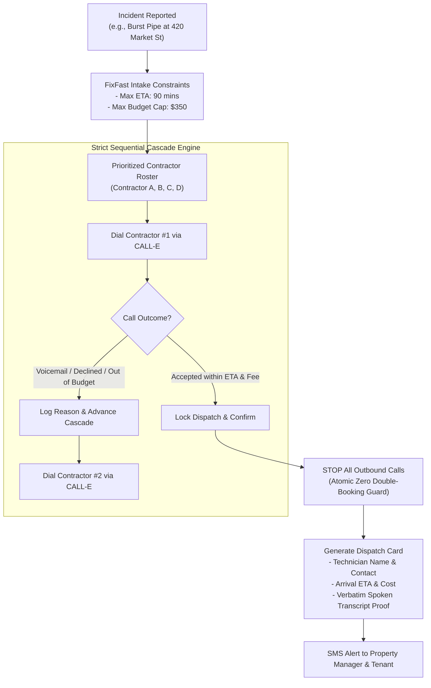

# FixFast ☎️🚨
### Autonomous Emergency Trades & Contractor Dispatch Agent
*Built with CALL-E for the "CALL-E: Your Code Is Calling" Hackathon 2026*

[](https://nextjs.org/)
[](https://heycall-e.com)
[](https://www.typescriptlang.org/)
[](https://tailwindcss.com/)
[](./LICENSE)

---

## 🚀 Awesome Phone Call Agents PR Submission

FixFast is submitted to the official community hub [CALLE-AI/awesome-phone-call-agents](https://github.com/CALLE-AI/awesome-phone-call-agents).

### README List Entry (under `### Apps`)
```markdown
- [FixFast](https://github.com/DheerajBishnoi/FixFast-Powered_by_Call-E) - Autonomous emergency contractor dispatch agent that negotiates arrival ETA and callout fees via sequential CALL-E phone calls, with strict budget/time caps, verbatim audio grounding, and an atomic stop that prevents double-booking.
```

### Pull Request Metadata
- **Target Repository**: `CALLE-AI/awesome-phone-call-agents` (Branch: `main`)
- **PR Title**: `Add FixFast: Autonomous Emergency Contractor Dispatch Agent (Apps)`
- **Category**: `apps/` & `skills/`
- **Submission Tier**: Hackathon / Live-Capable Demo (conforms to [Community Review Policy](https://github.com/CALLE-AI/awesome-phone-call-agents/blob/main/docs/community-review-policy.md))

---

## The Problem
When property disasters strike (burst pipes at 2:00 AM, restaurant walk-in coolers failing, broken storefront locks, sparking electric panels), **every 10 minutes of delay causes thousands in physical damage**.

- **Web forms & emails fail**: Emergency trades in the field only answer live voice calls.
- **The human bottleneck**: Property managers spend precious hours calling down vendor lists in the middle of the night.
- **Double-booking catastrophe**: Panic-calling multiple contractors simultaneously without coordination results in multiple trucks arriving at the doorstep, charging duplicate $150–$350 trip fees.

---

## The Solution: FixFast
**FixFast** is a goal-driven, sequential conversational phone dispatch engine built on **CALL-E**.



---

## Key Features & Architecture

1. **Strict Sequential Cascade State Machine**:
   - Dials contractors one-by-one according to priority.
   - Evaluates arrival ETA and callout fees against strict budget/time constraints.
   - Cuts off the cascade atomically the instant an agreement is confirmed (100% immune to double-booking).
2. **Audio Grounding & Anti-Hallucination**:
   - Parses verbatim spoken transcripts returned by CALL-E to verify that the technician explicitly agreed to the fee and arrival window before locking booking.
3. **Dual-Mode Engine (Dry-Run by Default)**:
   - **Judge Dry-Run Simulator (Default)**: Simulates realistic multi-turn calls with IVRs, fee negotiation, and dispatch confirmations without burning phone credits or requiring live phones.
   - **Live CALL-E Mode**: Integrates with the official CALL-E CLI / API (`plan_call` &rarr; confirm token &rarr; `run_call` &rarr; `get_call_run`).
4. **Emergency Ops Command Center**:
   - Dark-mode tactical UI with radar waterfall, animated audio waveform, live transcript drawer, and automated SMS receipts.
5. **Portable Agent Skill**:
   - Packaged in `skills/fixfast-emergency-dispatch/SKILL.md` for drop-in use in any AI agent framework (Claude Code, Cursor, OpenClaw, LangChain, skills.sh).

---

## Safety, Privacy & Review Policy Compliance

FixFast is built adhering strictly to the [Awesome Phone Call Agents Community Review & Merge Policy](https://github.com/CALLE-AI/awesome-phone-call-agents/blob/main/docs/community-review-policy.md):

| Policy Requirement | FixFast Implementation |
|---|---|
| **Default Dry-Run / Preview** | Runs in **Dry-Run Simulation Mode by default**. Zero live calls are placed, zero telephone credits consumed, and zero external side effects occur without deliberate operator toggle. |
| **Explicit Operator Intent** | Live calling requires toggling the switch to `Live CALL-E Mode` and explicitly clicking "Start Emergency Cascade". |
| **Side Effects Disclosure** | In live mode, FixFast initiates outbound telephone calls via CALL-E to negotiate emergency services. It binds dispatch only upon explicit verbal agreement within pre-authorized budget and ETA caps. |
| **Cancellation & Rollback** | Operators can cancel an active cascade at any time using the "Abort Cascade" control (`cancelCascadeSession`). Cascade immediately halts and cancels remaining roster calls. *Note on telephony limits:* If a live call is actively ringing or connected, closing the browser tab stops subsequent cascade dispatches, though an in-flight carrier call terminates according to standard provider timeout. |
| **Credential Handling** | CALL-E credentials (`CALLE_API_KEY` or `calle auth login`) reside strictly on the server/CLI environment. Keys are **never** transmitted to the browser client or exposed in frontend bundles. |
| **Phone Privacy & Masking** | All sample roster numbers use North American standards-reserved fictitious numbers (`+1 (415) 555-01XX`). Live destinations are configurable via `TEST_CONTRACTOR_PHONE`. User-facing logs mask sensitive digits. |
| **Duplicate Call Prevention** | An atomic lock stops further dials the instant an agreement is confirmed or when the roster is exhausted, preventing duplicate charges. |

---

## Quickstart

### Prerequisites
- Node.js 18+ (tested on Node 20 & 24)
- npm or yarn
- *(Optional for live calls)* CALL-E CLI authenticated (`npx calle auth login`) or `CALLE_API_KEY`

### Installation
```bash
# Clone repository
git clone https://github.com/DheerajBishnoi/FixFast-Powered_by_Call-E.git
cd FixFast-Powered_by_Call-E

# Install dependencies
npm install

# Run development server
npm run dev
```

Open [http://localhost:3000](http://localhost:3000) in your browser to interact with the FixFast Command Center.

---

## Testing Scenarios

FixFast includes 4 pre-configured emergency scenarios for instant evaluation:
- **Scenario 1**: 2:00 AM Burst Water Pipe (Plumbing) &bull; Max ETA 90m &bull; Max Budget $350
- **Scenario 2**: Restaurant Walk-in Freezer Down (HVAC) &bull; Max ETA 60m &bull; Max Budget $450
- **Scenario 3**: Storefront Main Glass Door Damaged (Locksmith) &bull; Max ETA 45m &bull; Max Budget $280
- **Scenario 4**: Sparking Electrical Subpanel (Electrical) &bull; Max ETA 75m &bull; Max Budget $400

---

## Portable Skill Integration

Install or run directly via `skills.sh`:

```bash
npx -y skills run ./skills/fixfast-emergency-dispatch \
  --trade plumbing \
  --address "420 Market St, Apt 4B, San Francisco, CA" \
  --description "Main supply line burst in master bathroom" \
  --max-eta 90 \
  --max-budget 350
```

---

## Submission Details
- **Hackathon**: [CALL-E: Your Code Is Calling (Devpost)](https://call-e.devpost.com/)
- **Submission Package**: See [DEVPOST_SUBMISSION.md](./DEVPOST_SUBMISSION.md) for full pitch script, architecture breakdown, and hackathon writeup.
- **Repository**: [https://github.com/DheerajBishnoi/FixFast-Powered_by_Call-E](https://github.com/DheerajBishnoi/FixFast-Powered_by_Call-E)
- **Video Pitch**: Included in Devpost submission.
