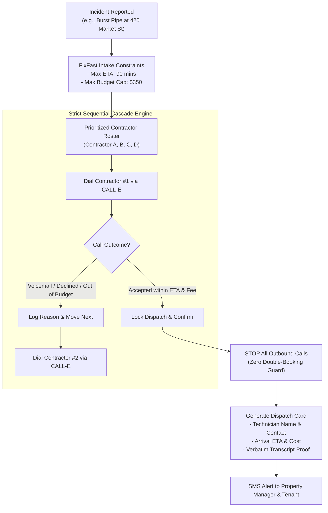

# FixFast ☎️🚨
### Autonomous Emergency Trades & Contractor Dispatch Agent
*Built with CALL-E for the "CALL-E: Your Code Is Calling" Hackathon 2026*

[](https://nextjs.org/)
[](https://heycall-e.com)
[](https://www.typescriptlang.org/)
[](https://tailwindcss.com/)

---

## The Problem
When property disasters strike (burst pipes at 2:00 AM, restaurant walk-in coolers failing, broken storefront locks, sparking electric panels), **every 10 minutes of delay causes thousands in physical damage**.

- **Web forms & emails fail**: Technicians in the field only answer live voice calls.
- **The human bottleneck**: Property managers spend precious hours calling down phone lists in the middle of the night.
- **Double-booking disaster**: Panic-calling multiple contractors without coordination results in multiple trucks arriving and charging duplicate $150–$350 trip fees.

---

## The Solution: FixFast
**FixFast** is a goal-driven, sequential conversational phone dispatch engine built on CALL-E.



---

## Key Features

1. **Strict Sequential Cascade State Machine**:
   - Dials contractors one-by-one according to priority.
   - Evaluates arrival ETA and callout fees against strict budget/time constraints.
   - Cuts off the cascade atomically the instant an agreement is confirmed (100% immune to double-booking).
2. **Audio Grounding & Anti-Hallucination**:
   - Parses the verbatim spoken dialogue returned by CALL-E to verify that the technician explicitly agreed to the fee and arrival window.
3. **Dual-Mode Engine**:
   - **Live CALL-E Mode**: Integrates with the official CALL-E CLI / API (`plan_call` &rarr; token &rarr; `run_call` &rarr; `get_call_run`).
   - **Judge Dry-Run Simulator**: Simulates complete realistic multi-turn calls with IVRs, fee negotiation, and dispatch confirmations without burning phone credits or requiring live phones.
4. **Emergency Ops Command Center**:
   - Dark-mode tactical UI with radar waterfall, animated audio waveform, live transcript drawer, and automated SMS receipts.
5. **Portable Agent Skill**:
   - Packaged in `skills/fixfast-emergency-dispatch/SKILL.md` for drop-in use in any AI agent framework (Claude Code, Cursor, OpenClaw, LangChain).

---

## Quickstart

### Prerequisites
- Node.js 18+ (tested on Node 20 & 24)
- npm or yarn

### Installation
```bash
# Clone repository
git clone https://github.com/your-username/FixFast.git
cd FixFast

# Install dependencies
npm install

# Run development server
npm run dev
```

Open [http://localhost:3000](http://localhost:3000) in your browser to interact with the FixFast Command Center.

---

## Testing Scenarios

FixFast includes 4 pre-configured emergency scenarios for instant evaluation:
- **Scenario 1**: 2:00 AM Burst Water Pipe (Plumbing) &bull; Max ETA 90m &bull; Max Budget $350
- **Scenario 2**: Restaurant Walk-in Freezer Down (HVAC) &bull; Max ETA 60m &bull; Max Budget $450
- **Scenario 3**: Storefront Main Glass Door Damaged (Locksmith) &bull; Max ETA 45m &bull; Max Budget $280
- **Scenario 4**: Sparking Electrical Subpanel (Electrical) &bull; Max ETA 75m &bull; Max Budget $400

---

## Portable Skill Integration

Install or run directly via `skills.sh`:

```bash
npx -y skills run ./skills/fixfast-emergency-dispatch \
  --trade plumbing \
  --address "420 Market St, Apt 4B, San Francisco, CA" \
  --description "Main supply line burst in master bathroom" \
  --max-eta 90 \
  --max-budget 350
```

---

## Hackathon Submission Details
- **Hackathon**: [CALL-E: Your Code Is Calling (Devpost)](https://call-e.devpost.com/)
- **Category**: Enterprise / Machine Learning & AI / Communications
- Full submission writeup and pitch script available in [DEVPOST_SUBMISSION.md](./DEVPOST_SUBMISSION.md).
